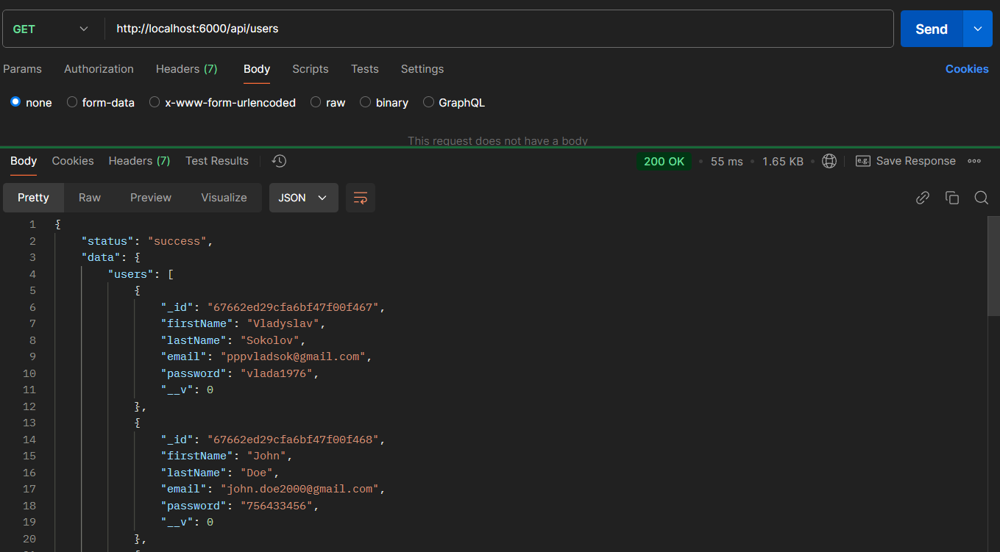
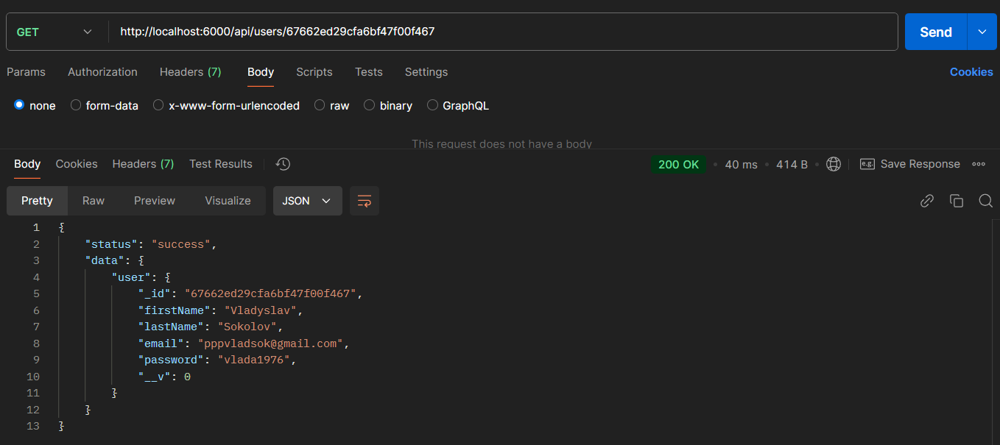
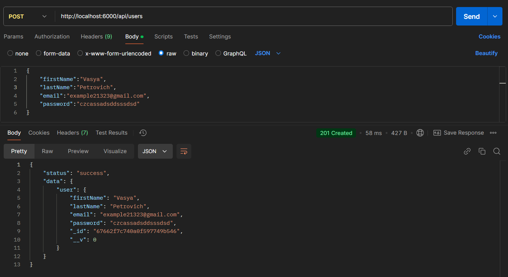
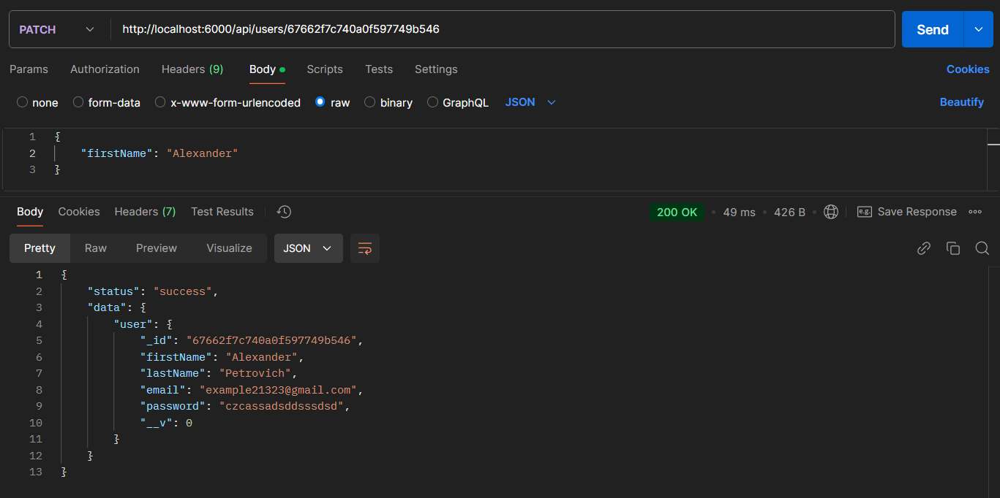
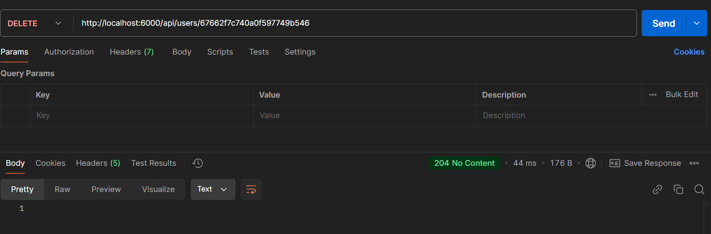
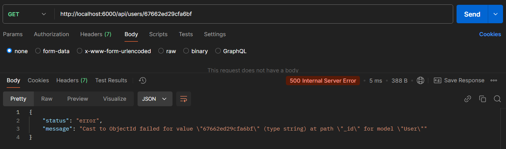
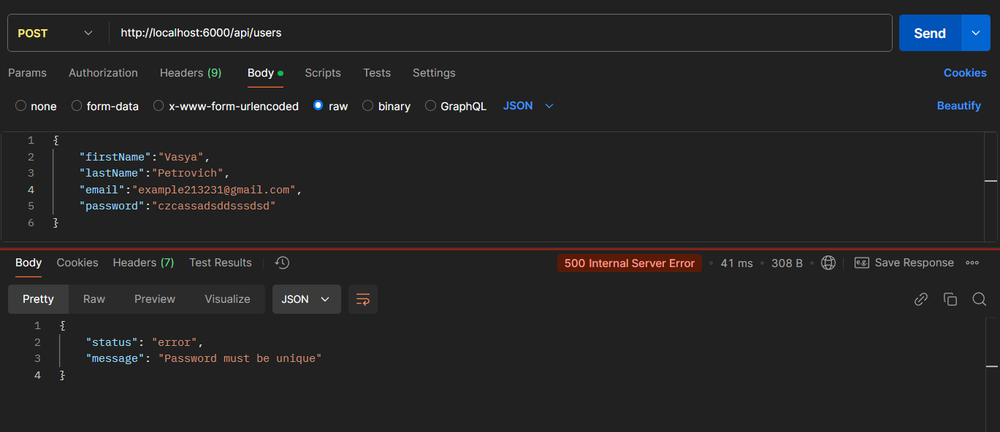
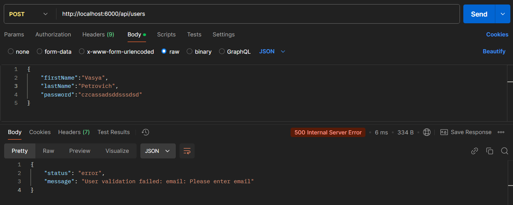
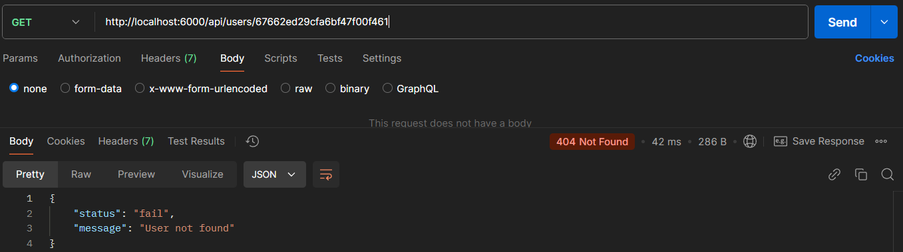

# Тестування працездатності системи

Тестування сервісу у Postman.

---

## Сценарії для користувача (User)

### GET api/users

### GET api/users/:id

### POST api/users

### PATCH api/users/:id

### DELETE api/users/:id

## Виключні сценарії для користувача (user Exceptions)

### EXCEPTION(user): Wrong id

### EXCEPTION(User): Field must be unique

### EXCEPTION(User): Field is required

### EXCEPTION(User): User Not Found

